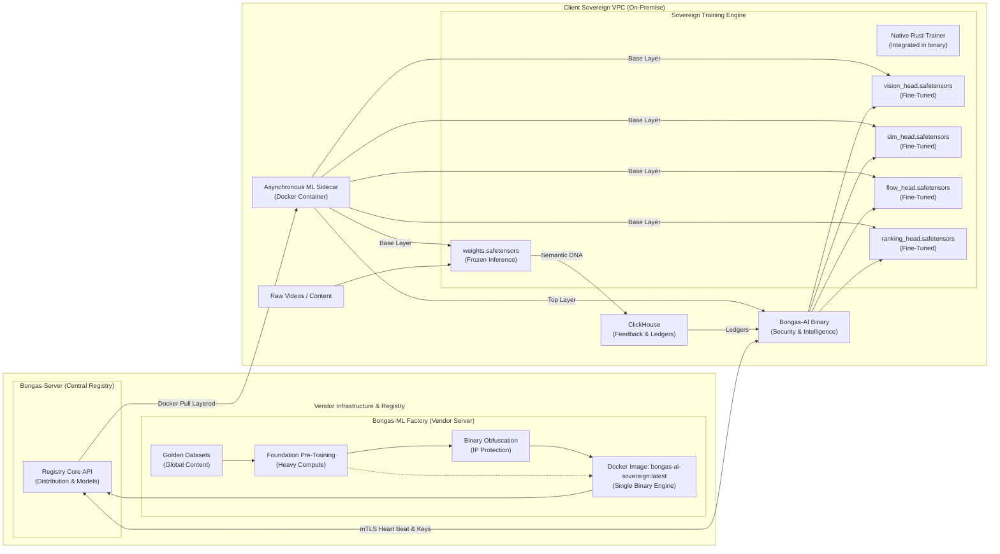

# 🧬 Sovereign Discovery: The Machine Learning Engine

> **The Vendor Safe Haven: Secure, Offline Development & Obfuscation Layer.**

Welcome to **BONGAS-ML**. This repository is the high-security environment for pre-training massive foundation models and defining the intelligence that powers the Bongas-AI ecosystem.

---

## 🏛️ The Sovereign Paradigm

👉 **[View the Interactive Bongas-ML Architecture Diagram](./docs/architecture/BONGAS_ML_INTERACTIVE_DIAGRAM.html)**
> ⚠️ **GitLab/GitHub Notice:** By default, repository platforms render `.html` files as raw source code for security reasons. To view the animations and interactive elements, please **download** the `BONGAS_ML_INTERACTIVE_DIAGRAM.html` file to your computer and open it in your web browser.

To balance **Data Sovereignty** with **Intellectual Property Protection**, this engine operates on a bifurcated architecture:

* **👁️ Frozen Senses:** 1.2B+ parameter models exported as read-only Safetensors.
* **🎓 Student Heads:** Minimal layers trained locally on private ClickHouse telemetry via the native Rust Training Pillar.
* **🛡️ Integrated Security:** The compiled binary handles its own integrity checks, heartbeats, and silent updates.

## 📚 Documentation Hub

Explore the full architectural blueprints and production workflows in our central knowledge base:

👉 **[Enter the Documentation Hub](./docs/README.md)**

---
[🏠 Home](./README.md) | [📚 Hub](./docs/README.md) | [🏗️ Factory](./docs/factory/WORKFLOWS.md)

### *BONGAS-AI - Unified Content Intelligence Orchestration for the Global Digital Economy*
