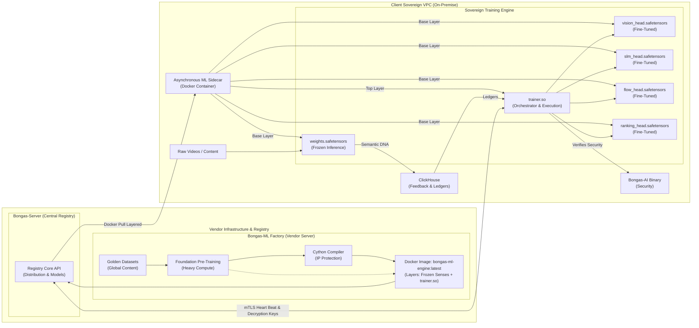

# 🏛️ Sovereign Intelligence: Architecture & Principles

[🏠 Hub](../README.md) | [🏗️ Architecture](./SOVEREIGN_INTELLIGENCE.md)

---

## 🏗️ The Bifurcated Control Plane

👉 **[View the Interactive Bongas-ML Architecture Diagram](./BONGAS_ML_INTERACTIVE_DIAGRAM.html)**
> ⚠️ **GitLab/GitHub Notice:** By default, repository platforms render `.html` files as raw source code for security reasons. To view the animations and interactive elements, please **download** the `BONGAS_ML_INTERACTIVE_DIAGRAM.html` file to your computer and open it in your web browser.

To maintain both data sovereignty and intellectual property, the architecture is split into two distinct execution tiers:

### 1. The Frozen Senses (Foundation Models)

We pre-train massive models (e.g., 1.2B+ parameters) on our proprietary "Golden Datasets" at the vendor site.

* **Format:** Exported as Read-Only `.safetensors` (Candle-compatible).
* **Role:** Performs heavy "Sensing" (Feature Extraction) on the client's raw data (Video, Text, Audio).
* **Constraint:** These models are "Frozen" on the client site. They are never retrained or modified on-premise, ensuring zero data exfiltration during the learning process.

### 2. The Local Student (Head Models)

The "Frozen Senses" produce semantic DNA vectors. The **Student Heads** are minimal neural networks that learn to translate that DNA into the client's specific business metrics.

* **Format:** Lightweight, trainable PyTorch modules (eventually exported as Safetensors).
* **Role:** Trained on the client's on-premise ClickHouse interaction ledgers.
* **Intelligence:** This is the part that learns the "Local Context" (e.g., specific regional safety standards, custom tribal tags).

---

## 🎼 The Four Intelligence Pillars

We have unified all discovery intelligence into four specialized pillars:

### 👁️ The Eye (Vision Intelligence)

* **Base:** `sight-core` (Frozen)
* **Student:** `vision_head.safetensors`
* **Responsibility:** Forensic maturity auditing (18+, Kids), Motion Entropy, and visual vibe categorization.

### 📚 The Librarian (Language Intelligence)

* **Base:** `sense-core` (Frozen SLM)
* **Student:** `slm_head.safetensors`
* **Responsibility:** Reasoning, generating content summaries, and cultural tag refinement.

### 🎻 The Conductor (Tribe Intelligence)

* **Base:** Generic Tribe Embeddings
* **Student:** `ranking_head.safetensors`
* **Responsibility:** Mapping Behavioral Tribes to Content DNA based on local aggregate interaction logs.

### 🏎️ The Sequence (Flow Intelligence)

* **Base:** `flow-core` (BERT4Rec-style Transformer)
* **Student:** `flow_head.safetensors`
* **Responsibility:** Predicting the user's "next-path" in a session based on real-time sequential history.

---

## 🛡️ The Security Model: The ML Sidecar & Cryptographic Leash

The code that trains the **Student Heads** is our most sensitive IP, and the 1.3GB+ foundation model poses a massive deployment challenge. We solve this by abandoning raw files and using a **Sovereign Docker Image** with a **Cryptographic Leash**.

### 1. The Layered Docker Architecture (`bongas-ml-engine:latest`)

We distribute intelligence as a strictly compiled Docker image.

* **The Base Layer (Heavy/Frozen):** Contains the 1.3GB `weights.safetensors` (Frozen Senses). This layer rarely changes, meaning the client downloads it once.
* **The Top Layer (Light/Agile):** Contains `trainer.so` (the obfuscated Cython training loops). If we push a 5MB math patch, the client's Docker daemon only downloads this tiny 5MB layer, ensuring instant updates without network strain.

### 2. The Cryptographic Leash (3-Tier Security)

If the client isolates the container, the IP protects itself:

* **Tier 1 (mTLS):** The ML Docker container and the Rust `bongas-ai` binary communicate using Mutual TLS certificates generated dynamically by `Bongas-Server`.
* **Tier 2 (Decryption Keys):** The Frozen Senses and Base Heads are shipped *encrypted*. On startup, `trainer.so` performs a heartbeat to `Bongas-Server` to fetch runtime decryption keys into memory.
* **Tier 3 (Dynamic Hyperparameters):** `trainer.so` does not contain hardcoded learning rates or decay functions. It requests them from the central server. If the network is cut, the training loop degrades and fails.

---

## 🔄 Sovereign Lifecycle: Orchestrator-Led Hot-Swaps

We achieve **zero-touch, silent updates** of the core `bongas-ai` binary without the client executing scripts or tripping the `trainer.so` security guard.

1. **Registry Pre-Flight:** The CI/CD pipeline pushes a new `bongas-ai` binary (v2.1) to `Bongas-Server` and registers its new SHA-256 hash.
2. **The Secure Ping:** During its nightly heartbeat, `trainer.so` detects the outdated version and receives the secure download link and the new valid hash.
3. **Staging:** `trainer.so` silently downloads the new binary into a hidden temporary folder and verifies the cryptographic hash against the server's signature.
4. **The "Graceful" Hot-Swap:**
    * `trainer.so` updates its internal security ledger to authorize the new hash.
    * It sends a signal to the running `bongas-ai` process to drain requests and shut down gracefully.
    * It replaces the binary file.
    * It spins the new `bongas-ai` process back up, re-verifies the hash, and restores mTLS connections. Zero client intervention required.

---
[🏠 Hub](../README.md) | [🔝 Top](#️-sovereign-intelligence-architecture--principles)
