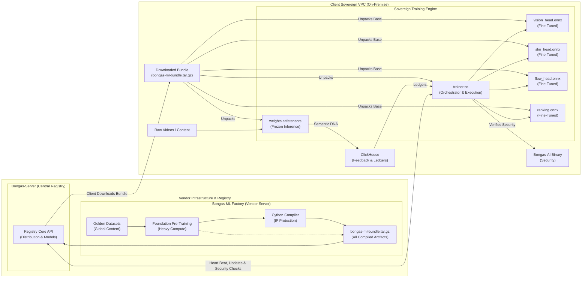

# 🏛️ Sovereign Intelligence: Architecture & Principles

[🏠 Hub](../README.md) | [🏗️ Architecture](./SOVEREIGN_INTELLIGENCE.md)

---

## 🏗️ The Bifurcated Control Plane

👉 **[View the Interactive Bongas-ML Architecture Diagram](./BONGAS_ML_INTERACTIVE_DIAGRAM.html)**
> ⚠️ **GitLab/GitHub Notice:** By default, repository platforms render `.html` files as raw source code for security reasons. To view the animations and interactive elements, please **download** the `BONGAS_ML_INTERACTIVE_DIAGRAM.html` file to your computer and open it in your web browser.

To maintain both data sovereignty and intellectual property, the architecture is split into two distinct execution tiers:

### 1. The Frozen Senses (Foundation Models)

We pre-train massive models (e.g., 1.2B+ parameters) on our proprietary "Golden Datasets" at the vendor site.

* **Format:** Exported as optimized ONNX graphs or Read-Only `.safetensors`.
* **Role:** Performs heavy "Sensing" (Feature Extraction) on the client's raw data (Video, Text, Audio).
* **Constraint:** These models are "Frozen" on the client site. They are never retrained or modified on-premise, ensuring zero data exfiltration during the learning process.

### 2. The Local Student (Head Models)

The "Frozen Senses" produce semantic DNA vectors. The **Student Heads** are minimal neural networks that learn to translate that DNA into the client's specific business metrics.

* **Format:** Lightweight, trainable PyTorch modules (eventually exported as ONNX).
* **Role:** Trained on the client's on-premise ClickHouse interaction ledgers.
* **Intelligence:** This is the part that learns the "Local Context" (e.g., specific regional safety standards, custom tribal tags).

---

## 🎼 The Four Intelligence Pillars

We have unified all discovery intelligence into four specialized pillars:

### 👁️ The Eye (Vision Intelligence)

* **Base:** `sight-core` (Frozen)
* **Student:** `vision_head.onnx`
* **Responsibility:** Forensic maturity auditing (18+, Kids), Motion Entropy, and visual vibe categorization.

### 📚 The Librarian (Language Intelligence)

* **Base:** `sense-core` (Frozen SLM)
* **Student:** `slm_head.onnx`
* **Responsibility:** Reasoning, generating content summaries, and cultural tag refinement.

### 🎻 The Conductor (Tribe Intelligence)

* **Base:** Generic Tribe Embeddings
* **Student:** `ranking.onnx`
* **Responsibility:** Mapping Behavioral Tribes to Content DNA based on local aggregate interaction logs.

### 🏎️ The Sequence (Flow Intelligence)

* **Base:** `flow-core` (BERT4Rec-style Transformer)
* **Student:** `flow_head.onnx`
* **Responsibility:** Predicting the user's "next-path" in a session based on real-time sequential history.

---

## 🛡️ The Security Model: `trainer.so`

The code that trains the **Student Heads** is our most sensitive IP. It is never shipped as raw Python. Instead:

1. We develop the training logic in `factory/trainer/`.
2. We compile it into an obfuscated C-extension (`trainer.so`) using Cython.
3. The client only receives the binary, which allows them to run the training on their private data without viewing our proprietary algorithms.

---
[🏠 Hub](../README.md) | [🔝 Top](#️-sovereign-intelligence-architecture--principles)
