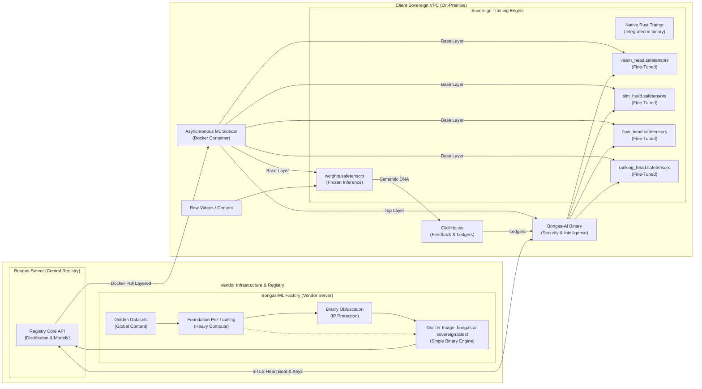

# 🏛️ Sovereign Intelligence: Architecture & Principles

[🏠 Hub](../README.md) | [🏗️ Architecture](./SOVEREIGN_INTELLIGENCE.md)

---

## 🏗️ The Bifurcated Control Plane

👉 **[View the Interactive Bongas-ML Architecture Diagram](./BONGAS_ML_INTERACTIVE_DIAGRAM.html)**
> ⚠️ **GitLab/GitHub Notice:** By default, repository platforms render `.html` files as raw source code for security reasons. To view the animations and interactive elements, please **download** the `BONGAS_ML_INTERACTIVE_DIAGRAM.html` file to your computer and open it in your web browser.

To maintain both data sovereignty and intellectual property, the architecture is split into two distinct execution tiers:

### 1. The Frozen Senses (Foundation Models)

We pre-train massive models (e.g., 1.2B+ parameters) on our proprietary "Golden Datasets" at the vendor site.

* **Format:** Exported as Read-Only `.safetensors` (Candle-compatible).
* **Role:** Performs heavy "Sensing" (Feature Extraction) on the client's raw data (Video, Text, Audio).
* **Constraint:** These models are "Frozen" on the client site. They are never retrained or modified on-premise, ensuring zero data exfiltration during the learning process.

### 2. The Local Student (Head Models)

The "Frozen Senses" produce semantic DNA vectors. The **Student Heads** are minimal neural networks that learn to translate that DNA into the client's specific business metrics.

* **Format:** Lightweight, trainable Rust modules (native Candle).
* **Role:** Trained asynchronously by the native Rust Training Pillar.
* **Intelligence:** This is the part that learns the "Local Context" (e.g., specific regional safety standards, custom tribal tags).
* **Integrated Trainer:** All training logic is compiled directly into the `bongas-ai` binary. This ensures IP protection through machine-code obfuscation without requiring external sidecar processes.

---

## 🎼 The Four Intelligence Pillars

We have unified all discovery intelligence into four specialized pillars:

### 👁️ The Eye (Vision Intelligence)

* **Base:** `sight-core` (Frozen)
* **Student:** `vision_head.safetensors`
* **Responsibility:** Forensic maturity auditing (18+, Kids), Motion Entropy, and visual vibe categorization.

### 📚 The Librarian (Language Intelligence)

* **Base:** `sense-core` (Frozen SLM)
* **Student:** `slm_head.safetensors`
* **Responsibility:** Reasoning, generating content summaries, and cultural tag refinement.

### 🎻 The Conductor (Tribe Intelligence)

* **Base:** Generic Tribe Embeddings
* **Student:** `ranking_head.safetensors`
* **Responsibility:** Mapping Behavioral Tribes to Content DNA based on local aggregate interaction logs.

### 🏎️ The Sequence (Flow Intelligence)

* **Base:** `flow-core` (BERT4Rec-style Transformer)
* **Student:** `flow_head.safetensors`
* **Responsibility:** Predicting the user's "next-path" in a session based on real-time sequential history.

---

## 🛡️ The Security Model: The Unified Engine

Bongas-AI achieves **100% Data Sovereignty** by moving model evolution and engine orchestration directly into the client's VPC. We provide a true "Single Binary" experience where all intelligence and security are native to the Rust core.

### 1. The Single Binary Architecture (`bongas-ai-sovereign:latest`)

We distribute intelligence as a strictly compiled Rust executable.

* **The Senses Layer:** Contains the 1.3GB `weights.safetensors` (Frozen Senses).
* **The Intelligence Core:** Contains the high-performance Rust engine. All security heartbeats and training loops are integrated natively.

### 2. Integrated Sovereign Guard (3-Tier Security)

The binary protects itself using built-in resilience layers:

* **Tier 1 (mTLS):** The Rust `bongas-ai` binary and `Bongas-Server` communicate using Mutual TLS certificates generated dynamically.
* **Tier 2 (Decryption Keys):** The Frozen Senses are shipped *encrypted*. On startup, the engine performs a heartbeat to `Bongas-Server` to fetch runtime decryption keys into memory.
* **Tier 3 (Binary Integrity):** The engine constantly monitors its own SHA-256 hash. If tampering is detected, it enters a protective lockdown state.

---

## 🔄 Sovereign Lifecycle: Self-Orchestrated Hot-Swaps

We achieve **zero-touch, silent updates** of the core `bongas-ai` binary natively.

1. **Registry Pre-Flight:** The CI/CD pipeline pushes a new `bongas-ai` binary (v2.1) to `Bongas-Server`.
2. **The Secure Ping:** During its internal heartbeat, the engine detects the outdated version and receives a secure download link.
3. **Staging:** The engine silently downloads the new binary into a hidden temporary folder and verifies the cryptographic hash.
4. **The "Graceful" Hot-Swap:**
    * The engine sends a signal to its own process manager to drain requests.
    * It triggers a silent update, replacing the binary and restarting with the new configuration. Zero client intervention required.

---
[🏠 Hub](../README.md) | [🔝 Top](#️-sovereign-intelligence-architecture--principles)
